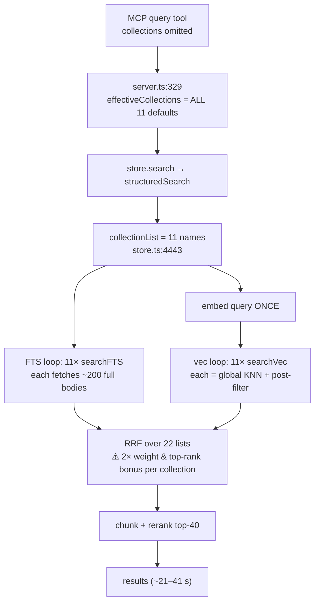
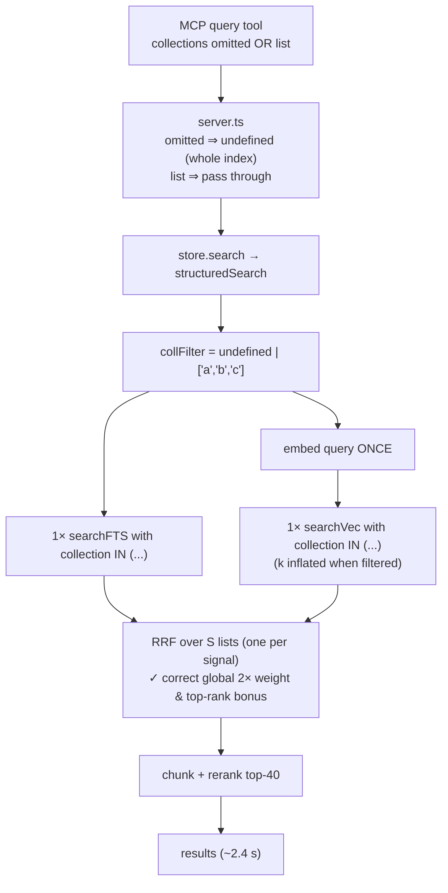

# Unified multi-collection search — one-pass query over a unified index

**Date:** 2026-07-08
**Status:** Design / investigation only (do NOT implement from this doc yet)
**Author:** investigation for Hein (qmd-hub prod latency)
**Repo:** `heintonny/qmd` (fork), measured against qmd 2.1.0
**Scope:** `src/store.ts::structuredSearch`, `src/mcp/server.ts`, `src/index.ts`, `src/cli/qmd.ts`, `src/store.ts::searchFTS` / `searchVec`

---

## 1. TL;DR

qmd-hub prod (qmd 2.1.0) sees ~2.4 s for a single-collection query but 21–41 s for
"all 11 collections" **or** for "no filter" — even though all 11 collections already
live in **one** SQLite index (`/data/xdg-cache/qmd/index.sqlite`, `documents.collection`
is just a partition column).

The slowdown is **not** SQLite. There are two compounding defects:

1. **The MCP `query` tool never actually searches "the whole index".** When the client
   omits `collections`, `src/mcp/server.ts` substitutes **the full list of default
   collection names** (line 329 / line 673). So "no filter" from the client becomes
   "filter to all 11 collections" internally — which then hits the serial loop below.

2. **`structuredSearch` iterates collections serially.** `src/store.ts` lines
   4442–4504 run one FTS query **and** one vector KNN query **per collection, per
   sub-query**. With 11 collections and a typical `lex`+`vec` request that is
   `11 × (1 FTS + 1 vec) = 22` SQL round trips, each `searchFTS` call materializing up
   to `limit × 10 = 200` **full document bodies** (`content.doc`) into JS. That is the
   ~11× multiplier.

There is also a **correctness bug** riding along: the per-collection loop breaks RRF
score semantics (the "first sub-query gets 2× weight" rule and the per-list top-rank
bonus are applied per *collection list*, not per *query signal*), and the per-collection
vector search post-filters a global top-`k` KNN, so a collection whose chunks are not in
the global top-60 silently returns nothing.

**Fix direction:** push the collection filter *into* the SQL (`collection IN (...)`) and
delete the per-collection loop so the pipeline runs **one embed → one vec pass → one lex
pass → one global RRF → one rerank**, exactly like the already-correct single-collection
path. This is a net simplification.

**Estimated effort: M** (medium). It touches 3–4 files, changes two SQL builders and one
orchestration function, and requires care around the vec KNN `k` inflation and MCP
backward compat — but it *removes* code rather than adding a subsystem.

---

## 2. Current query flow (traced)

### 2.1 Call path

```
MCP tools/call "query"                       src/mcp/server.ts:321
  → effectiveCollections = collections ?? defaultCollectionNames   server.ts:329   ⚠️ (defect 1)
  → store.search({ queries, collections })   server.ts:331
      → QMDStore.search                      src/index.ts:384
          → structuredSearch(internal, …)    src/index.ts:397
              → collectionList = collections ?? [undefined]        store.ts:4443
              → for coll of collectionList:   store.ts:4448  (FTS)  ⚠️ (defect 2)
                  store.searchFTS(q, 20, coll)                     store.ts:3024
              → for coll of collectionList:   store.ts:4484  (vec)  ⚠️ (defect 2)
                  store.searchVec(q, …, 20, coll, emb)             store.ts:3099
              → reciprocalRankFusion(rankedLists, weights)         store.ts:4510 → 3346
              → chunk + rerank candidates (≤ candidateLimit=40)    store.ts:4528–4609
```

### 2.2 Defect 1 — the MCP layer defeats the fast path

`src/mcp/server.ts` (the `query` tool handler) and the REST `/query` handler both do:

```ts
// server.ts:329 (MCP tool)  and  server.ts:673 (REST)
const effectiveCollections = collections ?? defaultCollectionNames;
const results = await store.search({
  queries,
  collections: effectiveCollections.length > 0 ? effectiveCollections : undefined,
  …
});
```

`defaultCollectionNames` is `getDefaultCollectionNames()` = every collection with
`include_by_default = 1` (`src/index.ts:452`). On qmd-hub prod that is all 11.

Consequence: a client that sends **no** `collections` field does **not** get the
"`collectionList = [undefined]` → one global pass" code path. It gets
`collectionList = [11 names]` → the 11× serial loop. This is why "no filter" is measured
as slow (21–41 s) even though the internal one-pass path exists and is fast. The client
literally cannot reach the fast path through MCP today.

### 2.3 Defect 2 — the per-collection serial loop

```ts
// src/store.ts:4442
const collectionList = collections ?? [undefined]; // undefined = all collections

// Step 1: FTS — one query PER collection PER lex sub-query
for (const search of searches) {
  if (search.type === 'lex') {
    for (const coll of collectionList) {          // ← serial loop
      const ftsResults = store.searchFTS(search.query, 20, coll);
      …rankedLists.push(…)
    }
  }
}

// Step 2: vec — one KNN PER collection PER vec/hyde sub-query
for (let i = 0; i < vecSearches.length; i++) {
  …
  for (const coll of collectionList) {            // ← serial loop
    const vecResults = await store.searchVec(vecSearches[i].query, …, 20, coll, undefined, embedding);
    …rankedLists.push(…)
  }
}
```

The query embedding is computed **once** (`llm.embedBatch`, store.ts:4477) — good — but
each `searchVec` call still re-runs the sqlite-vec `MATCH` KNN scan.

### 2.4 Why each loop iteration is expensive (the real 11× cost)

`searchFTS` (store.ts:3024) fetches **10× the limit** when a collection filter is present,
and every returned row carries the **full document body**:

```ts
// store.ts:3038
const ftsLimit = collectionName ? limit * 10 : limit;   // 200 vs 20
// store.ts:3052
content.doc as body,                                    // ← full markdown per candidate
```

So per lex sub-query the serial loop pulls up to `11 × 200 = 2200` full document bodies
out of SQLite and into JS strings, versus `20` for a single no-filter pass. `searchVec`
similarly returns full `content.doc` bodies and runs the KNN 11 times. The dominant cost
is SQLite row I/O + JS string allocation for thousands of full documents, not the FTS/vec
index math itself.

(Note the CTE comment at store.ts:3028–3032: an earlier fix already learned that mixing
the collection filter with `MATCH` in one `WHERE` made the planner drop the FTS index and
full-scan — turning 8 ms into 17 s. The CTE forces FTS first, then filters. The proposed
`collection IN (...)` change must preserve this CTE-first structure.)

### 2.5 Correctness bug hiding in the loop

Two RRF invariants break when `rankedLists` is "one list per collection" instead of
"one list per query signal":

- **First-list 2× weight.** `structuredSearch` assigns `weights = rankedLists.map((_, i) => i === 0 ? 2.0 : 1.0)` (store.ts:4509). The intent is "the caller's first sub-query
  is the strongest signal, give it 2×." But with the loop, `rankedLists[0]` is
  *"lex results for the first collection"*, so the 2× boost leaks onto whichever
  collection happens to be iterated first, not onto the first query type.
- **Per-list top-rank bonus.** `reciprocalRankFusion` adds `+0.05` to the rank-0 doc of
  **each** list (store.ts:3378–3384). With 11 lists, 11 different documents each receive
  the top-rank bonus, flattening the global ordering.
- **Vector KNN post-filter starvation.** `searchVec` (store.ts:3106–3145) fetches the
  global top `k = limit × 3 = 60` nearest chunks first, *then* filters by `d.collection`
  in step 2. A collection whose best chunk ranks #61 globally returns **zero** vec hits
  for that collection even though it has relevant content. Per-collection vec search over
  a unified index is therefore both slow and lossy.

A single global pass produces exactly two lists (`[lex-global, vec-global]`), so the 2×
weight lands on the true first signal, the top-rank bonus applies once to the true global
top, and the KNN returns the true global top-`k`. **The fix improves ranking quality, not
just latency.**

### 2.6 The CLI already does (most of) the right thing

`src/cli/qmd.ts::querySearch` (line 2340) shows the intended pattern:

```ts
const singleCollection = collectionNames.length === 1 ? collectionNames[0] : undefined;
results = await structuredSearch(store, structuredQueries, {
  collections: singleCollection ? [singleCollection] : undefined,   // >1 collection → undefined → ONE pass
  …
});
// then post-filter in JS (qmd.ts:2437)
if (collectionNames.length > 1) results = results.filter(/* prefix match */);
```

So for a multi-collection CLI search the CLI already does **one global pass + JS
post-filter** — fast, but the post-filter is applied *after* rerank/slice, so it can throw
away results and under-return (e.g. ask for 2 collections, one global pass fills the top-40
candidates mostly from collection C, post-filter drops them, you get 3 results back). This
is the argument for pushing the filter into SQL (`IN`) instead of post-filtering in JS.

---

## 3. Desired behavior

| Client input | Desired internal behavior |
|---|---|
| `collections` omitted or `[]` | Search **entire index**. `structuredSearch` runs with no collection predicate: one embed, one vec KNN, one lex FTS, one global RRF/rerank. |
| `collections: ["a","b","c"]` | Same single-pass pipeline, but every SQL retrieval carries `d.collection IN ('a','b','c')` so filtering happens **in the query**, before RRF, rerank, and slice. |
| `collections: ["a"]` | Degenerate `IN` with one value; identical to today's single-collection fast path. |

Ranking must remain **global** across the selected scope: the RRF/blend scores that map
to the displayed `100% / 50% / 33% …` must reflect one global fusion, not per-collection
normalization or per-collection top-rank bonuses.

---

## 4. Proposed code changes

The theme: **make the collection filter a set that is pushed into SQL, and delete the
per-collection loop.** Nothing new is added to the ranking pipeline.

### 4.1 `searchFTS` — accept a collection set, build an `IN` clause

`src/store.ts:3024`

```ts
// BEFORE
export function searchFTS(db, query, limit = 20, collectionName?: string): SearchResult[]

// AFTER — accept string | string[]; empty/undefined = whole index
export function searchFTS(
  db: Database,
  query: string,
  limit = 20,
  collections?: string | string[],
): SearchResult[] {
  const ftsQuery = buildFTS5Query(query);
  if (!ftsQuery) return [];

  const collSet = normalizeCollections(collections);   // [] = no filter
  const hasFilter = collSet.length > 0;

  // Keep the CTE-first structure (store.ts:3028 comment) — do NOT fold the
  // collection predicate into the MATCH WHERE clause.
  const ftsLimit = hasFilter ? limit * 10 : limit;
  const params: (string | number)[] = [ftsQuery];

  let sql = `
    WITH fts_matches AS (
      SELECT rowid, bm25(documents_fts, 1.5, 4.0, 1.0) as bm25_score
      FROM documents_fts
      WHERE documents_fts MATCH ?
      ORDER BY bm25_score ASC
      LIMIT ${ftsLimit}
    )
    SELECT 'qmd://' || d.collection || '/' || d.path as filepath, …
    FROM fts_matches fm
    JOIN documents d ON d.id = fm.rowid
    JOIN content ON content.hash = d.hash
    WHERE d.active = 1
  `;

  if (hasFilter) {
    sql += ` AND d.collection IN (${collSet.map(() => '?').join(',')})`;
    params.push(...collSet);
  }

  sql += ` ORDER BY fm.bm25_score ASC LIMIT ?`;
  params.push(limit);
  …
}
```

Add a tiny helper (module-local):

```ts
function normalizeCollections(c?: string | string[]): string[] {
  if (!c) return [];
  return (Array.isArray(c) ? c : [c]).filter(Boolean);
}
```

Note on `ftsLimit`: with an `IN` over many collections the ×10 inflation may over-fetch;
`limit * 10` is a safe upper bound and matches current behavior for the single-collection
case. If profiling shows it hurts, scale by selectivity (e.g. `limit * (1 + collSet.length)`
capped) — but keep it simple first.

### 4.2 `searchVec` — accept a collection set, filter in step 2, inflate `k`

`src/store.ts:3099`. The sqlite-vec `MATCH` cannot JOIN or filter (store.ts:3106–3109 warns
about hangs), so the collection filter must stay in step 2 — but we must inflate `k` so
enough in-scope chunks survive:

```ts
export async function searchVec(
  db, query, model, limit = 20,
  collections?: string | string[],
  session?, precomputedEmbedding?,
): Promise<SearchResult[]> {
  …
  const collSet = normalizeCollections(collections);
  const hasFilter = collSet.length > 0;

  // Inflate KNN fetch when filtering so in-scope docs aren't starved by
  // out-of-scope neighbours (mirrors the FTS ×10 candidate-inflation trick).
  const knnK = hasFilter ? limit * 10 : limit * 3;

  const vecResults = db.prepare(`
    SELECT hash_seq, distance FROM vectors_vec
    WHERE embedding MATCH ? AND k = ?
  `).all(new Float32Array(embedding), knnK);
  …
  // step 2 document lookup — add IN alongside the existing hash_seq IN
  if (hasFilter) {
    docSql += ` AND d.collection IN (${collSet.map(() => '?').join(',')})`;
    params.push(...collSet);
  }
}
```

Trade-off: inflating `k` for the *whole-index* case (no filter) is unnecessary — that's why
`hasFilter ? limit*10 : limit*3` keeps the unfiltered path cheap. Even `limit*10` KNN over
~15k vectors is a single brute-force scan (sqlite-vec has no ANN here), so cost is roughly
constant regardless of `k`; the win is doing it **once** instead of 11×.

### 4.3 `structuredSearch` — delete the loop, one pass

`src/store.ts:4399`. Remove `collectionList` and both `for (const coll …)` loops:

```ts
// BEFORE (store.ts:4442–4464, 4480–4502)
const collectionList = collections ?? [undefined];
for (const search of searches) {
  if (search.type === 'lex') {
    for (const coll of collectionList) {
      const ftsResults = store.searchFTS(search.query, 20, coll);
      …
    }
  }
}
… // and the analogous vec loop

// AFTER
const collFilter = collections && collections.length > 0 ? collections : undefined;
for (const search of searches) {
  if (search.type === 'lex') {
    const ftsResults = store.searchFTS(search.query, 20, collFilter);  // one call, IN-filtered
    if (ftsResults.length > 0) { …rankedLists.push(…) }
  }
}
…
for (let i = 0; i < vecSearches.length; i++) {
  const embedding = embeddings[i]?.embedding;
  if (!embedding) continue;
  const vecResults = await store.searchVec(
    vecSearches[i].query, DEFAULT_EMBED_MODEL, 20, collFilter, undefined, embedding,
  );                                                                    // one call, IN-filtered
  if (vecResults.length > 0) { …rankedLists.push(…) }
}
```

Result: `rankedLists` again has exactly one entry per query signal, so the `weights`
`i === 0 ? 2.0 : 1.0` and the RRF top-rank bonus regain their intended global semantics
(§2.5). No change needed to `reciprocalRankFusion`, chunking, rerank, or blend.

`hybridQuery` (store.ts:4003) takes a single `collection?: string` today. It can be left as
a single-collection API, or widened to `collections?` the same way for parity — but the
MCP/`store.search` path uses `structuredSearch`, so `hybridQuery` is not on the hot path
for qmd-hub. Recommend widening it too for consistency (low risk, same helper), but it can
be a follow-up.

### 4.4 The store interface / SDK signatures

`src/store.ts:1128–1129` (the `Store` interface) and `src/store.ts:1642–1643` (the
implementation) must widen `collectionName?: string` → `collections?: string | string[]`.
`src/index.ts:419–420` (`searchLex`/`searchVector`) pass `opts?.collection` — keep the
single-collection SDK options but forward as a 1-element array, or add `collections?` to
`LexSearchOptions`/`VectorSearchOptions` (`src/index.ts:171–210`). Backward compatible if
`string` is still accepted.

### 4.5 `src/mcp/server.ts` — stop forcing the all-collections filter (the key MCP change)

This is the most important behavioral fix and the smallest diff. Today (server.ts:329 and
673) an omitted `collections` becomes "all defaults." Change it so **omitted means whole
index**:

```ts
// BEFORE (server.ts:329)
const effectiveCollections = collections ?? defaultCollectionNames;
const results = await store.search({
  queries,
  collections: effectiveCollections.length > 0 ? effectiveCollections : undefined,
  …
});

// AFTER — omitted collections ⇒ search the whole index in one pass
const results = await store.search({
  queries,
  collections: collections && collections.length > 0 ? collections : undefined,
  …
});
```

Apply the same edit to the REST `/query` handler (server.ts:673).

Backward-compat considerations:
- If some deployments *rely* on "omitted = only default collections" to hide non-default
  collections from search, this change would widen the search scope. On qmd-hub prod all
  11 are `include_by_default`, so scope is identical — but this is a **behavior change** to
  call out. If hiding non-default collections matters, keep the default-substitution but
  make it a single `IN (...)` filter (which is now cheap) instead of the 11× loop. That
  preserves visibility semantics while still fixing latency. **Recommended: gate on whether
  any non-default collections exist**; if all collections are default, pass `undefined`
  (true whole-index, fastest); otherwise pass the default set as an `IN` filter.
- `defaultCollectionNames` can then be used only to build that optional `IN` list, not to
  drive a loop.

### 4.6 `src/cli/qmd.ts` — replace JS post-filter with SQL filter

`querySearch` (line 2370) and `vectorSearch` (line 2295) currently pass
`singleCollection ? [singleCollection] : undefined` and then JS-post-filter (lines 2437,
2309). After 4.1–4.3, pass the **full** validated set straight through and delete the
post-filter:

```ts
// qmd.ts:2370
results = await structuredSearch(store, structuredQueries, {
  collections: collectionNames.length > 0 ? collectionNames : undefined,  // was singleCollection?[…]:undefined
  …
});
// delete the `if (collectionNames.length > 1) results = results.filter(...)` block (qmd.ts:2437)
```

This fixes the CLI under-return bug (§2.6) as a bonus. `filterByCollections` and the
`singleCollection` computation become dead code (leave `filterByCollections` if other call
sites use it — `search()` at qmd.ts:2243 still uses it for the lex-only `search` command;
that command can also switch to the `IN` filter).

---

## 5. Tests to add / update

Harness pattern (from `test/store.test.ts` and `test/structured-search.test.ts`):
`createStore(tmpDbPath)` → `store.insertContent(hash, body, now)` →
`store.insertDocument(collection, path, title, hash, now, now)`. Embeddings require the LLM
session, so pure vec tests are integration-tier; FTS + RRF tests are unit-tier and fast.

**Update — `test/multi-collection-filter.test.ts`**
The current tests assert the *JS post-filter* semantics (`filterByCollections` no-ops for
≤1 collection). After the SQL-filter migration those semantics move into `searchFTS`/
`searchVec`. Repurpose the file (or add a new `test/collection-in-filter.test.ts`) to:
- Assert `searchFTS(db, q, 20, ["a","b"])` returns only docs from `a`/`b` and **excludes**
  `c` — verifying the `IN` predicate in SQL, not a JS post-filter.
- Assert `searchFTS(db, q, 20, [])` and `searchFTS(db, q, 20, undefined)` both search the
  whole index.
- Assert `searchFTS(db, q, 20, "a")` (string form) still works (backward compat).

**New — `test/unified-search-one-pass.test.ts`**
- Build a store with 3 collections (`a`, `b`, `c`), a handful of docs each, distinct terms.
- `structuredSearch(store, [{type:'lex',query:'…'}])` with `collections: undefined` returns
  docs from all three; with `collections: ['a','b']` returns none from `c`.
- **Ranking invariant:** verify the top result’s displayed score for a query with an obvious
  best doc is stable and identical whether that doc’s collection is queried alone or as part
  of the multi-collection set (guards the "global ranking, not per-collection normalization"
  requirement).
- **Regression guard for defect 2.5:** with two lex sub-queries and `collections:['a','b','c']`,
  assert `rankedLists.length === (#lex signals) + (#vec signals)` — i.e. the number of ranked
  lists no longer scales with collection count. (Expose via the `explain` trace or a spy.)

**Update — `test/rrf-trace.test.ts`**
Add a case asserting that with N collections the RRF trace has one contribution list per
query signal (not per collection), and the 2× weight is on the first *signal*.

**Perf smoke (optional, `test/` or a bench script under `src/bench/`)**
Assert wall-clock for `collections:[all]` is within a small constant factor of
`collections:[one]` (not 11×). Keep it lenient to avoid flakiness on CI.

---

## 6. Performance model

Let:
- `F` = cost of one FTS query + materializing its rows (dominated by full-body I/O),
- `V` = cost of one vector KNN + step-2 body materialization,
- `R` = chunk + rerank cost (bounded by `candidateLimit = 40`, ~constant),
- `E` = embedding cost (already computed once, ~constant),
- `N` = number of collections in scope, `S` = number of sub-queries (typ. 2: lex+vec).

| Scenario | Today | After fix |
|---|---|---|
| 1 collection | `F + V + R + E` (~2.4 s) | `F + V + R + E` (~2.4 s, unchanged) |
| 11 collections | `≈ 11·F + 11·V + R + E` (~21–41 s) | `F + V + R + E` (~2.4 s) |
| no filter (client omits) | today = 11 collections path (~21–41 s) | `F + V + R + E` (~2.4 s) |

The fix collapses the `N·(F+V)` term to a single `F+V`. Expected all-collections latency
drops from ~21–41 s to roughly the single-collection ~2.4 s (plus a small delta because the
one global FTS/vec fetch inflates `k`/`ftsLimit` modestly, and rerank now sees a more
diverse top-40 candidate pool — but `R` is capped by `candidateLimit`). Net: **~10× faster
for catalog-wide search, effectively O(1) in collection count.**

Rerank (`R`) is the residual floor. If ~2.4 s is still too slow for qmd-hub’s interactive
paths, the follow-up levers are: lower `candidateLimit`, or pass `rerank:false`
(`skipRerank`) for latency-sensitive surfaces (already supported, store.ts:4376).

---

## 7. Risks & regressions

1. **Rerank candidate pool composition.** One global RRF over the whole index means the
   top-40 candidates handed to rerank can be dominated by one dense collection. That is
   *correct* global behavior, but if a caller expected "some results from every collection,"
   they will not get it. Mitigation: none needed for the stated requirement (global ranking
   is the goal); document the change.
2. **Vector KNN `k` inflation.** `k = limit*10` under a filter increases the sqlite-vec scan
   result set and step-2 body fetch. Bounded and one-time; validate on the 3.2 GB / ~15k-doc
   prod index. If memory is a concern, cap `k` (e.g. `min(limit*10, 300)`).
3. **Full-body materialization is still there.** Both `searchFTS` and `searchVec` still
   `SELECT content.doc`. The fix removes the 11× multiplier but a single global fetch of
   `ftsLimit`+`knnK` full bodies is still non-trivial for large docs. A separate, orthogonal
   optimization: defer body loading until after RRF (fetch bodies only for the ≤40 candidates
   that survive fusion). Out of scope here but worth a follow-up issue — it would shave the
   residual `F`/`V`.
4. **MCP scope-widening (backward compat).** §4.5 changes "omitted ⇒ default collections"
   to "omitted ⇒ whole index." Identical on qmd-hub (all default), but a behavior change for
   deployments with non-default collections. Mitigation: the gated approach in §4.5 (pass
   `undefined` only when all collections are default; otherwise a cheap `IN` of defaults).
5. **CTE planner regression.** The `collection IN (...)` predicate must stay outside the
   FTS5 `MATCH` CTE (store.ts:3028 lesson). Verify `EXPLAIN QUERY PLAN` still uses the FTS5
   index after the change — add a guard test or a manual check on prod.
6. **`hybridQuery` divergence.** If `hybridQuery` is left single-collection while
   `structuredSearch` goes multi, the CLI `qmd query` (auto-expand path) and the structured
   path behave differently for multi-collection. Recommend widening `hybridQuery` too.
7. **sqlite-vec metadata filtering not used.** We deliberately keep the post-`MATCH` filter
   (step 2) rather than a partitioned vec table, because the prod index has no partition key
   and rebuilding is expensive. If a future re-index adds a `collection` partition column to
   `vectors_vec`, the KNN could filter natively and `knnK` inflation could drop — note for
   later, not now.

---

## 8. qmd-hub integration

qmd-hub currently works around the qmd defect by fanning out **one MCP call per
collection** (`heintonny/qmd-hub/lib/mcp-client.ts`):

- `queryDocs` (line 147) and `searchCollections` (line 226): for `collections.length > 1`
  it does `Promise.allSettled(collections.map(c => queryDocsSingle(query, [c], …)))`
  (line 238), then re-sorts merged hits by score (line 252).

Problems this creates (all fixed upstream by §4):
- **Redundant embeds.** Each of the 11 parallel calls re-embeds the same query in qmd
  (`llm.embedBatch` per call) — 11× embedding work.
- **Broken score merge.** Each single-collection call returns per-collection blended scores
  (the `100/50/33…` are computed within that collection’s fusion). Merging by raw percentage
  across independent fusions (line 252) is not a valid global ranking — a #1 in a tiny
  collection outranks a genuinely better #2 in a big one.
- **Timeout pressure.** The comment at line 189–191 spells it out: "A single MCP call with N
  collections is processed roughly serially by the worker (~2s each), which exceeds the
  default 20s client timeout." Hence the fan-out.

**After the qmd fix, revert the fan-out:**

1. Delete the `collections.length > 1` fan-out branch in `queryDocs` (mcp-client.ts:153–157)
   and in `searchCollections` (mcp-client.ts:232–255). Always call the single MCP `query`
   with the full `collections` array (or omit it for whole-index). `queryDocsSingle`
   (line 209) already does exactly the right shape — make it the only path.
2. Because one unified call is now ~2.4 s (not 11×2 s), the `QMD_MCP_TIMEOUT_MS` default of
   20 000 ms (mcp-client.ts:19) is comfortable. Consider lowering to ~10 000 ms once verified,
   or keep 20 s as headroom for cold rerank cache.
3. Drop `formatHitsAsQueryText` / manual re-sort scaffolding (mcp-client.ts:194, 252) for the
   multi-collection case — qmd now returns a single correctly-ranked list, so
   `parseHits(text)` on the one response is sufficient.
4. Empty `collections` array should map to "omit the field" so qmd searches the whole index
   in one pass (matches §4.5). `queryDocs` already only sets `args.collections` when
   `collections.length > 0` (line 166) — keep that.

Net qmd-hub result: 1 MCP call instead of 11, correct global ranking, ~10× faster
catalog-wide search, and ~90 % less redundant embedding load on the qmd worker.

---

## 9. Current vs proposed flow (mermaid)

### Current (per-collection serial loop)



### Proposed (single global pass, SQL IN filter)



---

## 10. Summary of file-level changes

| File | Function | Change |
|---|---|---|
| `src/store.ts` | `searchFTS` (3024) | `collectionName?: string` → `collections?: string \| string[]`; `d.collection IN (...)`; keep CTE-first. |
| `src/store.ts` | `searchVec` (3099) | same signature widening; `IN` in step-2 doc lookup; inflate `k` when filtered. |
| `src/store.ts` | `structuredSearch` (4399) | delete `collectionList` + both `for (const coll …)` loops; single filtered call each. |
| `src/store.ts` | `Store` iface (1128) + impl (1642) | widen `searchFTS`/`searchVec` signatures. |
| `src/store.ts` | `hybridQuery` (4003) | (recommended) widen `collection?` → `collections?` for parity. |
| `src/index.ts` | `search` (384), `searchLex`/`searchVector` (419) | forward `collections` array; accept string for compat. |
| `src/mcp/server.ts` | `query` tool (329), REST `/query` (673) | omitted `collections` ⇒ `undefined` (whole index); optionally gated default-`IN`. |
| `src/cli/qmd.ts` | `querySearch` (2370), `vectorSearch` (2295), `search` (2243) | pass full collection set to SQL filter; remove JS post-filter (2309, 2437). |
| `test/multi-collection-filter.test.ts` | — | repurpose to assert SQL `IN` semantics. |
| `test/unified-search-one-pass.test.ts` | — | new: one-pass + global-ranking + list-count regression. |
| `test/rrf-trace.test.ts` | — | assert one contribution list per signal. |

---

## 11. Verification checklist (for the eventual implementer, not now)

- [ ] `EXPLAIN QUERY PLAN` on the modified `searchFTS` still uses `documents_fts` (no full scan).
- [ ] `collections:[all 11]` latency on prod index ≈ single-collection latency (not 11×).
- [ ] `collections:undefined` returns the same ranking as `collections:[all]` (once all are default).
- [ ] Top-1 result score for a known query is identical single-collection vs multi-collection.
- [ ] `#rankedLists === #lex signals + #vec signals`, independent of collection count.
- [ ] qmd-hub reverted to single MCP call; timeouts comfortable; catalog search correct.
